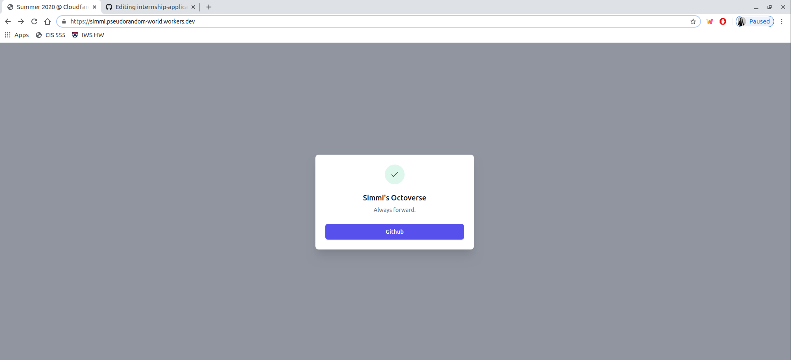

# Cloudflare Workers Internship Application: Full-Stack

## Deployed project: https://simmi.pseudorandom-world.workers.dev/
Thank you Cloudfare for this learning opportunity! Can't wait to hear from you. 

## Screenshot below for my version:


## What is it?

Using Cloudflare Workers, you'll deploy an application that will randomly send users to one of two webpages. This project will teach you how to write applications with the Cloudflare Workers API, manage and develop them using the command-line tool Wrangler, and deploy them to the free workers.dev deployment playground.

## Useful Links

- [Workers Quick Start documentation](https://developers.cloudflare.com/workers/quickstart/)
- [Fetch API](https://developer.mozilla.org/en-US/docs/Web/API/Fetch_API)
- [HTMLRewriter](https://developers.cloudflare.com/workers/reference/apis/html-rewriter/)
- [Cookie documentation](https://developer.mozilla.org/en-US/docs/Web/HTTP/Cookies)

## Get Started

### 1. Install the workers command-line tool wrangler.

The Workers Quick Start in the documentation shows how to get started with Wrangler, creating a project, and configuring and deploying it. We highly recommend that you spend time reading and following along with this guide!

To begin, install the [Wrangler](https://github.com/cloudflare/wrangler) command-line tool.

### 2. Generate a new project using `wrangler generate` command

Using the `generate` command (covered in the Quick Start), generate a new project with a name of your choice:

```sh
$ wrangler generate your-project-name https://github.com/cloudflare-internship-2020/internship-application-fullstack
```

### 3. Use `wrangler dev` to locally test/develop your application

The recently launched [`wrangler dev`](https://github.com/cloudflare/wrangler#-dev) feature will allow you to begin developing your application using `localhost` - this means that you can test your project locally and make sure it works, without having to sort out deployment until later in the exercise.

Note that a major benefit of using `wrangler dev` is the ability to output `console.log` statements to your terminal - this is super useful for inspecting HTTP responses and variables!

## Requirements

### 1. Request the URLs from the API

Make a fetch request inside of your script's event handler to the URL `https://cfw-takehome.developers.workers.dev/api/variants`, and parse the response as JSON. The response will be an array of URLs, which should be saved to a variable.

### 2. Request a (random: see #3) variant

Make a fetch request to one of the two URLs, and return it as the response from the script.

### 3. Distribute requests between variants

The `/api/variants` API route will return an array of two URLs. Requests should be evenly distributed between the two urls, in A/B testing style. This means that when a client makes a request to the Workers script, the script should roughly return each variant around 50% of the time.

## Deployment

### 1. Register a workers.dev subdomain

Every Workers user has access to a free, unique workers.dev subdomain, which allows you to deploy your projects to a stable URL without needing to purchase domains and configure DNS records. Following the Quick Start linked above includes setting up a workers.dev subdomain!

### 2. A user should be able to visit the deployed version of the site

Using wrangler's `publish` command, you can deploy your application and make it available under your workers.dev subdomain. Make sure to include this when you submit your project!

## Submitting your project

When submitting your project, you should prepare your code for upload to Greenhouse. The preferred method for doing this is to create a "ZIP archive" of your project folder: for more instructions on how to do this on Windows and Mac, see [this guide](https://www.sweetwater.com/sweetcare/articles/how-to-zip-and-unzip-files/).

In addition to submitting your project code, you should also submit the URL of your deployed project (see "Deployment"). This will be in the format `your-project-name.your-subdomain.workers.dev`.

## Extra Credit

### 1. Changing copy/URLs

For each variant page, there are a number of items on the page that can be customized. Try changing the following values inside of the variant, adding your own text or URLs:

- `title`: the title of the web page, displayed on the window or tab title in your browser.
- `h1#title`: the main title of the page. By default, this displays "Variant 1" or "Variant 2"
- `p#description`: the description paragraph on the page. By default, this displays the text "This is variant X of the take home project!".
- `a#url`: a Call to Action link with strong emphasis on the page. Try changing this to a URL of your choice, such as your personal website, and make sure to update the text "Return to cloudflare.com" as well!

This can be done using the [HTMLRewriter](https://developers.cloudflare.com/workers/reference/apis/html-rewriter/) API built into the Workers runtime, or using simple text replacement.

### 2. Persisting variants

If a user visits the site and receives one of the two URLs, persist which URL is chosen in a cookie so that they always see the same variant when they return to the application. A cookie would be a great way to implement this!

### 3. Publish to a domain

If you have a registered domain/zone with Cloudflare, try deploying your project by customizing the `zone_id` and `route` in your `wrangler.toml`. Make sure to check out the [Quick Start](https://developers.cloudflare.com/workers/quickstart) in the Workers docs for details on how to do this! **Note:** domains cost money, so if you don't have one, please don't feel obligated to buy one for this exercise. This is an extra credit task and you won't be penalized for skipping this one, we promise!
